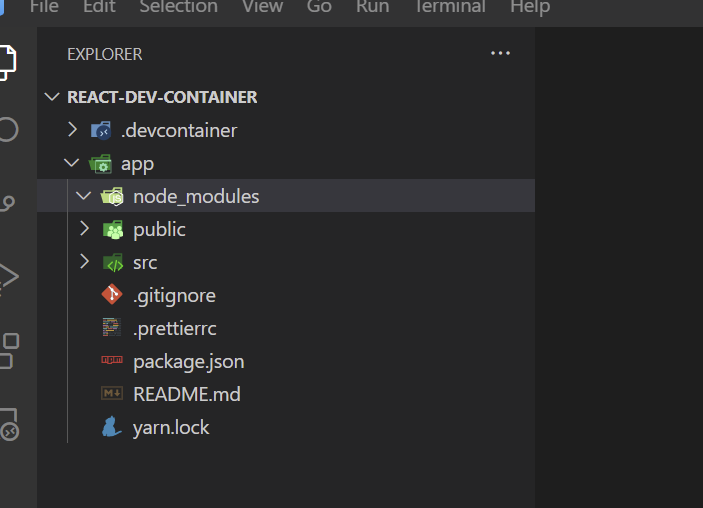

# Docker と VSCode で作る React デバッグ開発環境

## 環境

- Windows 11 Home 21H2
- Docker Desktop for Windows
- VSCode
- Dev Containers 拡張機能

## 用意するディレクトリ・ファイル構成

``` console
react-dev-container
  │
  └─ .devcontainer
        devcontainer.json
        docker-compose.yml
        Dockerfile
```

## 目次

1. プロジェクトディレクトリを作る
2. 起動するコンテナの設定ファイルを作る
3. Dockerfile を作る
4. docker-compose ファイルを作る
5. Dev Containers 拡張機能のインストール
6. コンテナに接続
7. コンテナ内で React プロジェクトを作る
8. React の開発用サーバを起動する
9. ホスト側に戻る
10. 名前付きボリュームがマウントされていないことの確認
11. 補足 1: コンテナに再接続したい場合
12. 補足 2: プロジェクトを Git Clone した場合
13. 補足 3: Docker コンテナを削除したい場合

## 1. プロジェクトディレクトリを作る

docker-compose を使用するので、フォルダ名が docker の images 名になる。
ここでは、ディレクトリ名を react-dev-container とする。

## 2. 起動するコンテナの設定ファイルを作る

プロジェクトディレクトリの直下に .devcontainer ディレクトリを作る。

このディレクトリの中に、起動するコンテナの設定を記述するために、
devcontainer.json を作成する。

### .devcontainer/devcontainer.json

``` json
{
	"name": "React Dev Docker Container",
	"dockerComposeFile": ["./docker-compose.yml"],
	"service": "react-dev",
	"workspaceFolder": "/app",
	"shutdownAction": "stopCompose",
	"extensions": [
		"dbaeumer.vscode-eslint",
		"esbenp.prettier-vscode",
		"vscode-icons-team.vscode-icons"
	],
	// コンテナ内に追加するVS Codeの設定
	"settings": {
		"eslint.workingDirectories": [
			{ "mode": "auto" }
		],
		"editor.codeActionsOnSave": {
			"source.fixAll.eslint": true
		  },
		  "eslint.format.enable": false,
		  "editor.formatOnSave": true,
		  "editor.lineNumbers": "on",
		  "files.insertFinalNewline": true,
		  "files.trimTrailingWhitespace": true,
		  "workbench.iconTheme": "vscode-icons"
	}
}
```

## 3. Dockerfile を作る

.devcontainer の中に Dockerfile を作成する。
Node.js の ver.16 を Docker イメージとして利用する。

### .devcontainer/Dockerfile

``` Dockerfile
FROM node:16
ENTRYPOINT tail -f /dev/null
```

## 4. docker-compose ファイルを作る

同じく .devcontainer ディレクトリ直下に docker-compose.yml を作る。

services のすぐ下の react-dev がサービス名。
`ディレクトリ名_サービス名` が image の名前になる（今回の場合 `react-dev-container_react-dev` となる）。

コンテナ内にReact プロジェクトを作成するディレクトリ名を app とし、
ホスト側（作業PC側）の app ディレクトリにマウント（同期）させる。

これにより、コンテナ内の app ディレクトリで行った変更を、
ホスト側の app ディレクトリにも反映されるようになる。

ただし、React プロジェクトのライブラリ管理ディレクトリである、
node_modules ディレクトリはマウントしたくない。

ディレクトリやファイルをホストと同期させる処理は重く、
膨大なファイルを扱う node_modules ディレクトリをマウントしてしまうと、
コンテナ内での動きが遅くなってしまう。

それを避けるために、「名前付きボリューム」として、
Docker Volume にマウントさせておくことで、
ファイルを永続化させたまま、ホストにマウントさせないようにする。

今回は node_modules というボリューム名を付けて、Docker Volume にマウントさせている。

### .devcontainer/docker-compose.yml

``` yaml
services:
  react-dev:
    build: .
    ports:
      - 3000:3000
    volumes:
      - ../app:/app
      - node_modules:/app/node_modules
    environment:
      - WATCHPACK_POLLING=true
volumes:
  node_modules:
```

## 5. Dev Containers 拡張機能のインストール

VSCode に Dev Containers 拡張機能をインストールする

Dev Containers:  
https://marketplace.visualstudio.com/items?itemName=ms-vscode-remote.remote-containers


## 6. コンテナに接続

ここまででコンテナに接続する準備は整った。

VSCode のウィンドウ左下にある、Dev Containers の接続アイコン `><` をクリックする。


アイコンをクリックすると、コマンドパレットに選択肢が表示されるので、
選択肢から `Reopen in Container` を選択する。

するとコンテナへの接続作業が行われ、ステータスバーが以下のようになる。
ステータスバーがこの状態になれば、コンテナに接続されている。


## 7. コンテナ内で React プロジェクトを作る

初めてコンテナに接続された状態で、docker-compose のマウント設定により、
`node_modules` ディレクトリが作成されているので、このディレクトリを削除したい。


なぜなら、ここに React のプロジェクトを作りたいのだが、
ディレクトリがあると、プロジェクト作成実行時にエラーとなってしまうからだ。

### マウントされたディレクトリの削除方法

Volume にマウントされているコンテナ内のディレクトリを直接削除することはできない。

マウントされたディレクトリを削除するには、
ホスト側のディレクトリを削除する必要がある。


ホスト側の app/node_modules を選択して、Shift + Del キーを押すと、
node_modules ディレクトリを削除できる。

ホスト側のディレクトリを削除後、
コンテナ内の node_modules ディレクトリを確認すると削除されているはずだ。

### React プロジェクトを新規作成するコマンド

コンテナ側の VSCode で Terminal を開き、以下のコマンドを実行して、
app ディレクトリ直下に、React プロジェクトを作成する。

`React プロジェクトを新規作成するコマンド（create-react-app を使用）`
``` console
npx create-react-app
```

`React プロジェクトを新規作成するコマンド（yarn を使用）`
``` console
yarn create react-app .
```

TypeScript で React プロジェクトを作成したい場合は、
`--template typescript` オプションをコマンドに付与する。

`TypeScript の React プロジェクトを新規作成するコマンド`
``` console
yarn create react-app --template typescript
```

コマンドによって、以下のようにプロジェクトファイルが作られていることを確認する。


### Prettier の設定ファイルを作る

プロジェクト（app ディレクトリ）直下に Prettier の設定ファイルを作る。

以下の例は、行の最大文字数 124、文字列の囲みをシングルクォートにする、
セミコロン省略、でコードを整形する設定となる。

`.prettierrc`
``` json
{
  "printWidth": 124,
  "singleQuote": true,
  "semi": false
}
```

## 8. React の開発用サーバを起動する

`yarn start` コマンドを実行して、開発用サーバを起動する。

`開発サーバを起動するコマンド`
``` console
yarn start
```

開発用サーバが起動すると、自動でブラウザが http://localhost:3000 でページを開く。


### ホットリロードが効いているかの確認

以下の App.js ファイルの「Learn React」と記載している部分に、
適当な文字列を追記してみる。

変更を保存したタイミングで、
ホットリロード（React がコードの変更を検知して、ブラウザのリロードが自動で行われる仕組み）
が働くかを確認する。


## 9. ホスト側に戻る

コンテナ内からホスト側に戻るには、以下の画面左下のステータスバーをクリックする。


ステータスバーをクリックすると、以下のように実行するアクションの選択肢が表示される。


この選択肢の中で、コンテナの接続解除に使えるのは、
選択肢の一番上の `Reopen Folder Locally` と、
選択肢の最下部の `Close Remote Connection` の2つ。

### Reopen Folder Locally

`Reopen Folder Locally` は、ホスト側のフォルダを開くアクション。
コンテナ内への接続を終了し、ホスト側のフォルダを開いた状態になる。

この際、コンテナは削除されることはなく、停止した状態となる。

### Close Remote Connection

`Close Remote Connection` は、コンテナへの接続を終了するアクション。
コンテナ内への接続を終了し、VSCode はフォルダを閉じた状態となる。

この際、コンテナは削除されることはなく、停止した状態となる。

## 10. 名前付きボリュームがマウントされていないことの確認

ホスト側に戻ってきたら、docker-compose で名前付きボリュームに設定したディレクトリが、
ローカルにマウント（同期）されていないことを確認する。

以下のキャプチャのように、
ホスト側の app ディレクトリの node_modules ディレクトリは空であることを確認する。



このようにコンテナ側の node_modules ディレクトリの中身を
ホスト側に同期させないことで、コンテナ側での動作を軽くすることができる。

## 補足 1: コンテナに再接続したい場合

コンテナに再接続した場合は、
初めてコンテナに接続した時と同じように、
VSCode のウィンドウ左下の Dev Containers 接続アイコン `><` をクリックする。

コンテナ側の node_modules は、Docker Volume に永続化されているため、
Volume を削除しない限り、コンテナに再接続しても node_modules 内のライブラリ群は残っているはずだ。

## 補足 2: プロジェクトを Git Clone した場合

Git リポジトリから Clone をして、初めてコンテナに接続して、
開発サーバを起動してもエラーになる。

node_modules に何もライブラリがインストールされていない状態だからだ。

最初に開発サーバを起動する前に、コンテナ内で `yarn` コマンドを実行して、
`pakage.json` に記載されたライブラリ群がインストールされた後に、
`yarn start` コマンドで開発サーバを起動するようにする。

`プロジェクトに必要なライブラリをインストールするコマンド`
``` console
yarn
```

`開発サーバを起動するコマンド`
``` console
yarn start
```

## 補足 3: Docker コンテナを削除したい場合

### 停止中のコンテナを確認する

起動中のコンテナを表示するには、`docker ps` コマンドを実行する。

`起動中のコンテナを表示するコマンド`
``` console
docker ps
```

ただし、`docker ps` コマンドは、停止中のコンテナは表示されない。

停止中のコンテナを含めて表示したい場合は、`-a`　オプションを付ける。

`停止中のコンテナを含めてコンテナをすべて表示する（-a オプション）`
``` console
docker ps -a
```

`実行結果例:`
``` console
CONTAINER ID   IMAGE                                        COMMAND                  CREATED        STATUS                        PORTS     NAMES
41595c20a1d7   react-dev-container_devcontainer-react-dev   "/bin/sh -c 'echo Co…"   21 hours ago   Exited (137) 12 minutes ago             react-dev-container_devcontainer-react-dev-1
```

### コンテナの削除

停止中のコンテナを削除するには、`docker rm` コマンドを実行する。

`docker rm` コマンドの引数には、CONTAINER ID を指定する。

`コンテナを削除するコマンド（CONTAINER ID に 41595c20a1d7 を指定した場合）`
``` console
docker rm 41595c20a1d7
```

`実行結果例:`
``` console
41595c20a1d7
```

### Docker volume を確認する

コンテナを削除しても永続化した volume は残り続けるので、
コンテナを削除したら、不要になった volume も削除したい。

Docker volume を確認するには、`docker volume ls` コマンドを実行する。

`Docker volume 一覧を表示するコマンド`
``` console
docker volume ls
```

`実行結果例:`
``` console
DRIVER    VOLUME NAME
local     react-dev-container_devcontainer_node_modules
local     vscode
```

### Docker volume の削除

Docker volume を削除するには、`docker volume rm` コマンドを実行する。

`Docker volume を削除するコマンド（VOLUME NAME に react-dev-container_devcontainer_node_modules を指定した場合）`
``` console
docker volume rm react-dev-container_devcontainer_node_modules
```

`実行結果例:`
``` console
Untagged: react-dev-container_devcontainer-react-dev:latest
react-dev-container_devcontainer_node_modules
```

### Docker image を確認する

Docker image を確認するには、`docker images` コマンドを実行する。

`Docker image 一覧を表示するコマンド`
``` console
docker images
```

`実行結果例:`
``` console
REPOSITORY                                   TAG       IMAGE ID       CREATED        SIZE
react-dev-container_devcontainer-react-dev   latest    751e32f814be   38 hours ago   911MB
```

### イメージの削除

Docker image を削除するには、`docker rmi` コマンドを実行する。

`Docker image を削除するコマンド（CONTAINER ID に 751e32f814be を指定した場合）`
``` console
docker rmi 751e32f814be
```

`実行結果例:`
``` console
Untagged: react-dev-container_devcontainer-react-dev:latest
Deleted: sha256:751e32f814be91e99bc823261be538e87c44c6bad33e6cbb0b50dd6a36601c7d
```

以上。
